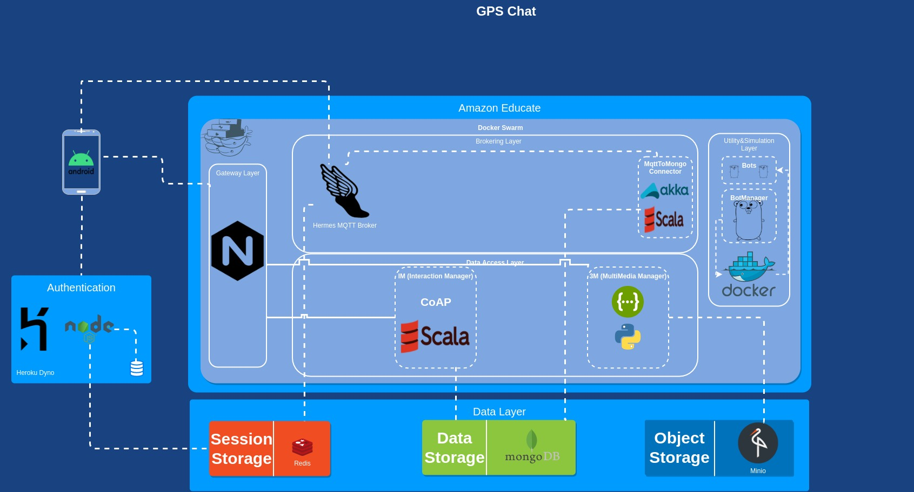

# GPSChat
A repository that holds components about the Proximity Chat.
The Hermes broker comes from [here](https://github.com/CarloP95/mqtt/tree/geomqtt). 
The authentication Server from [here](https://github.com/CarloP95/AuthenticationServerGPSChat).

## Architecture
An image of the architecture is presented down below to show what are the components of the chat architecture.
Redis is hosted by RedisLabs.
Mongo from Atlas.

